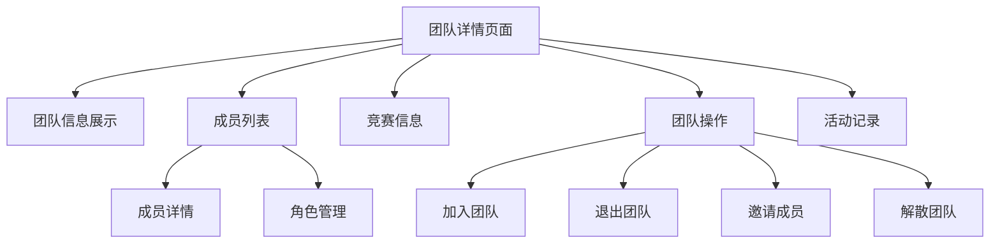

# 团队详情界面 - 产品需求文档

## 1. 产品概述

团队详情界面是学科北城竞赛管理系统中的核心功能模块，为用户提供完整的团队信息展示和管理功能。

该界面主要解决用户查看团队详细信息、管理团队成员、进行团队操作等需求，为学生用户提供便捷的团队协作体验。

通过团队详情界面，用户可以全面了解团队状态、成员构成、竞赛信息，并执行相应的团队管理操作。

## 2. 核心功能

### 2.1 用户角色

| 角色 | 访问权限 | 核心权限 |
|------|----------|----------|
| 团队成员 | 可查看团队详情 | 查看团队信息、成员列表、退出团队 |
| 团队队长 | 完整管理权限 | 管理成员、修改团队信息、解散团队、邀请成员 |
| 非团队成员 | 有限查看权限 | 查看基本团队信息、申请加入团队 |

### 2.2 功能模块

团队详情界面包含以下核心页面：

1. **团队详情页面**：团队基本信息展示、成员列表、竞赛关联信息
2. **成员管理区域**：成员详情展示、角色管理、状态跟踪
3. **团队操作区域**：加入团队、退出团队、解散团队等操作

### 2.3 页面详情

| 页面名称 | 模块名称 | 功能描述 |
|----------|----------|----------|
| 团队详情页面 | 团队信息展示模块 | 展示团队名称、描述、创建时间、状态、邀请码等基本信息 |
| 团队详情页面 | 竞赛关联模块 | 显示团队参与的竞赛信息，包括竞赛名称、状态、报名时间 |
| 团队详情页面 | 团队统计模块 | 展示团队成员数量、活跃度、参赛记录等统计信息 |
| 团队详情页面 | 成员列表模块 | 展示所有团队成员信息，包括姓名、角色、加入时间、状态 |
| 团队详情页面 | 成员详情模块 | 点击成员头像查看详细信息，包括个人资料、参赛历史 |
| 团队详情页面 | 角色管理模块 | 队长可修改成员角色，设置副队长、普通成员等 |
| 团队详情页面 | 成员操作模块 | 队长可移除成员，成员可退出团队 |
| 团队详情页面 | 邀请成员模块 | 队长可通过学号邀请新成员，生成邀请链接 |
| 团队详情页面 | 加入申请模块 | 非成员可申请加入团队，队长审核申请 |
| 团队详情页面 | 团队设置模块 | 队长可修改团队名称、描述、最大成员数等设置 |
| 团队详情页面 | 解散团队模块 | 队长可解散团队，需要确认操作并通知所有成员 |
| 团队详情页面 | 活动记录模块 | 展示团队活动历史，包括成员变更、参赛记录等 |

## 3. 核心流程

### 团队成员流程
团队成员访问团队详情页面后，可查看完整的团队信息和成员列表，了解团队参与的竞赛情况。成员可以查看其他成员的基本信息，并可选择退出团队。

### 团队队长流程
队长拥有完整的团队管理权限，可以邀请新成员、管理现有成员角色、修改团队设置。队长可以通过邀请码或学号邀请功能添加新成员，审核加入申请，并在必要时解散团队。

### 非团队成员流程
非团队成员可以查看团队的基本信息，了解团队的公开信息和参赛情况。如果团队允许申请加入，用户可以提交加入申请等待队长审核。

## 4. 用户界面设计

### 4.1 设计风格

- **主色调**：蓝色系 (#409EFF) 保持系统一致性，辅助色为绿色 (#67C23A) 表示成功状态
- **按钮样式**：圆角按钮设计，主要操作使用实心按钮，次要操作使用边框按钮
- **字体**：标题使用 18-24px，正文使用 14-16px，辅助信息使用 12px
- **布局风格**：卡片式布局，左右分栏设计，响应式适配
- **图标风格**：使用 Element Plus 内置图标，简洁现代的线性图标

### 4.2 页面设计概览

| 页面名称 | 模块名称 | UI元素 |
|----------|----------|--------|
| 团队详情页面 | 页面头部 | 面包屑导航、团队名称、状态标签、操作按钮组 |
| 团队详情页面 | 团队信息卡片 | 左侧团队头像、右侧基本信息、统计数据、竞赛关联 |
| 团队详情页面 | 成员列表区域 | 成员头像网格、角色标签、在线状态、操作菜单 |
| 团队详情页面 | 操作面板 | 浮动操作按钮、权限控制、确认对话框 |
| 团队详情页面 | 活动时间线 | 时间轴布局、活动图标、描述文本、时间戳 |
| 团队详情页面 | 邀请对话框 | 学号输入框、邀请码生成、分享按钮、有效期设置 |

### 4.3 响应式设计

采用移动优先的响应式设计，在桌面端使用左右分栏布局，移动端转换为上下堆叠布局。成员列表在大屏幕显示为网格布局，小屏幕自动调整为列表布局，确保在各种设备上的良好体验。