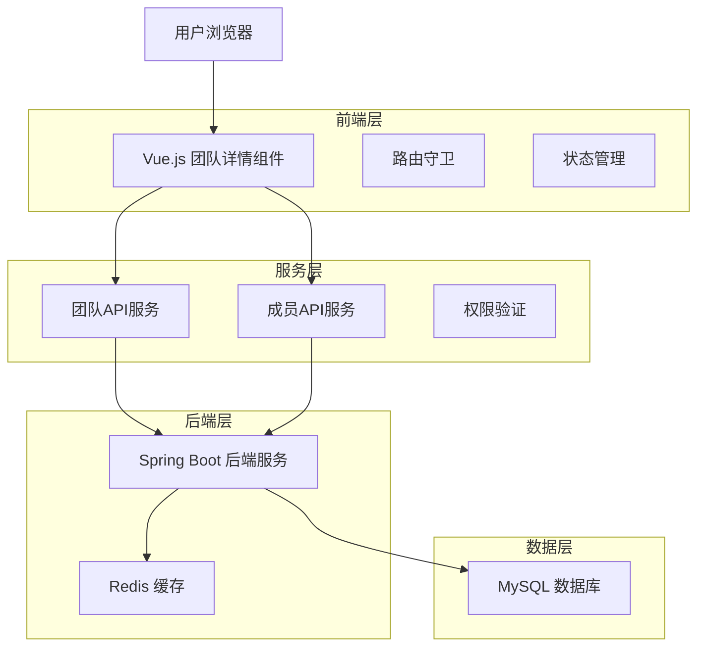
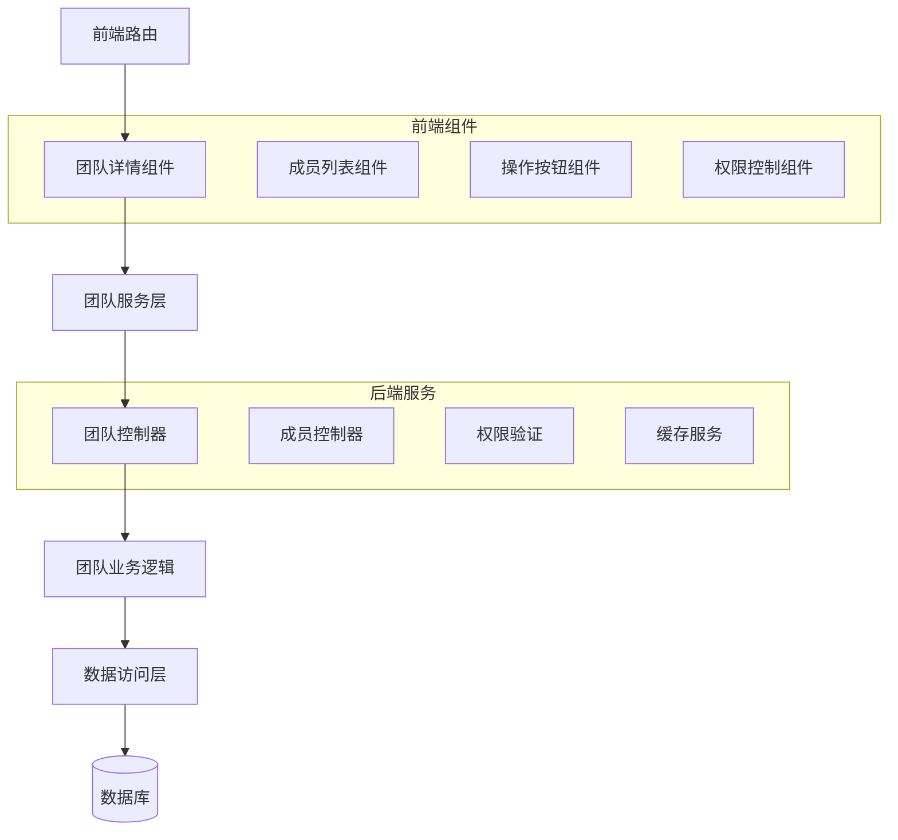
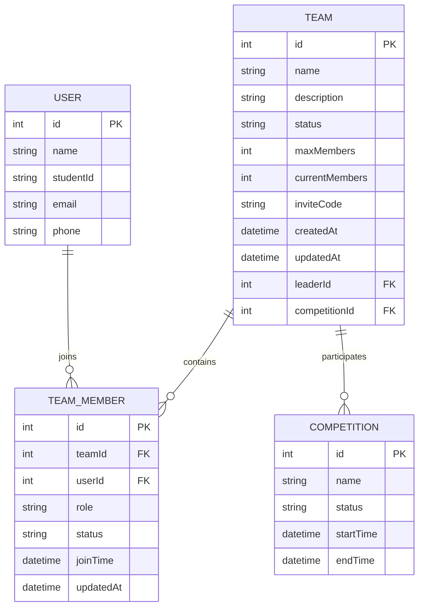

# 团队详情界面 - 技术架构文档

## 1. 架构设计



## 2. 技术描述

- **前端**: Vue.js@3 + Element Plus@2 + TypeScript + Vue Router@4 + Pinia
- **后端**: Spring Boot@2.7 + Spring Security + Spring Data JPA
- **数据库**: MySQL@8.0
- **缓存**: Redis@6.0

## 3. 路由定义

| 路由 | 用途 |
|------|------|
| /teams/:id | 团队详情页面，显示指定团队的完整信息 |
| /teams/:id/members | 团队成员管理页面（可选子路由） |
| /teams/:id/settings | 团队设置页面（队长专用） |

## 4. API定义

### 4.1 核心API

**获取团队详情**
```
GET /api/teams/{id}/details
```

请求参数:
| 参数名 | 参数类型 | 是否必需 | 描述 |
|--------|----------|----------|------|
| id | number | true | 团队ID |

响应参数:
| 参数名 | 参数类型 | 描述 |
|--------|----------|------|
| success | boolean | 请求是否成功 |
| data | object | 团队详细信息 |

示例响应:
```json
{
  "success": true,
  "data": {
    "id": 1,
    "name": "算法竞赛队",
    "description": "专注算法竞赛的团队",
    "status": "ACTIVE",
    "maxMembers": 5,
    "currentMembers": 3,
    "inviteCode": "ABC123",
    "createdAt": "2024-01-01T00:00:00Z",
    "competition": {
      "id": 1,
      "name": "ACM程序设计竞赛",
      "status": "ONGOING"
    },
    "leader": {
      "id": 1,
      "name": "张三",
      "studentId": "20210001"
    }
  }
}
```

**获取团队成员列表**
```
GET /api/team-members/team/{teamId}
```

请求参数:
| 参数名 | 参数类型 | 是否必需 | 描述 |
|--------|----------|----------|------|
| teamId | number | true | 团队ID |
| page | number | false | 页码，默认0 |
| size | number | false | 每页数量，默认20 |

响应参数:
| 参数名 | 参数类型 | 描述 |
|--------|----------|------|
| success | boolean | 请求是否成功 |
| data | array | 成员列表 |
| totalElements | number | 总成员数 |

示例响应:
```json
{
  "success": true,
  "data": [
    {
      "id": 1,
      "user": {
        "id": 1,
        "name": "张三",
        "studentId": "20210001",
        "email": "zhangsan@example.com"
      },
      "role": "LEADER",
      "status": "ACTIVE",
      "joinTime": "2024-01-01T00:00:00Z"
    }
  ],
  "totalElements": 3
}
```

**邀请成员加入团队**
```
POST /api/team-members/invite
```

请求参数:
| 参数名 | 参数类型 | 是否必需 | 描述 |
|--------|----------|----------|------|
| teamId | number | true | 团队ID |
| studentId | string | true | 被邀请学生的学号 |
| message | string | false | 邀请消息 |

响应参数:
| 参数名 | 参数类型 | 描述 |
|--------|----------|------|
| success | boolean | 邀请是否成功 |
| message | string | 响应消息 |

**申请加入团队**
```
POST /api/team-members/apply
```

请求参数:
| 参数名 | 参数类型 | 是否必需 | 描述 |
|--------|----------|----------|------|
| teamId | number | true | 团队ID |
| message | string | false | 申请消息 |

响应参数:
| 参数名 | 参数类型 | 描述 |
|--------|----------|------|
| success | boolean | 申请是否成功 |
| message | string | 响应消息 |

**移除团队成员**
```
DELETE /api/team-members/{memberId}
```

请求参数:
| 参数名 | 参数类型 | 是否必需 | 描述 |
|--------|----------|----------|------|
| memberId | number | true | 成员ID |

响应参数:
| 参数名 | 参数类型 | 描述 |
|--------|----------|------|
| success | boolean | 移除是否成功 |
| message | string | 响应消息 |

**退出团队**
```
POST /api/team-members/leave
```

请求参数:
| 参数名 | 参数类型 | 是否必需 | 描述 |
|--------|----------|----------|------|
| teamId | number | true | 团队ID |

响应参数:
| 参数名 | 参数类型 | 描述 |
|--------|----------|------|
| success | boolean | 退出是否成功 |
| message | string | 响应消息 |

**更新团队信息**
```
PUT /api/teams/{id}
```

请求参数:
| 参数名 | 参数类型 | 是否必需 | 描述 |
|--------|----------|----------|------|
| id | number | true | 团队ID |
| name | string | false | 团队名称 |
| description | string | false | 团队描述 |
| maxMembers | number | false | 最大成员数 |

响应参数:
| 参数名 | 参数类型 | 描述 |
|--------|----------|------|
| success | boolean | 更新是否成功 |
| message | string | 响应消息 |

**解散团队**
```
DELETE /api/teams/{id}
```

请求参数:
| 参数名 | 参数类型 | 是否必需 | 描述 |
|--------|----------|----------|------|
| id | number | true | 团队ID |

响应参数:
| 参数名 | 参数类型 | 描述 |
|--------|----------|------|
| success | boolean | 解散是否成功 |
| message | string | 响应消息 |

## 5. 服务器架构图



## 6. 数据模型

### 6.1 数据模型定义



### 6.2 数据定义语言

**团队表 (teams)**
```sql
-- 团队表已存在，无需重新创建
-- 确保包含必要字段
ALTER TABLE teams ADD COLUMN IF NOT EXISTS invite_code VARCHAR(20) UNIQUE;
ALTER TABLE teams ADD COLUMN IF NOT EXISTS updated_at TIMESTAMP DEFAULT CURRENT_TIMESTAMP ON UPDATE CURRENT_TIMESTAMP;

-- 创建索引
CREATE INDEX IF NOT EXISTS idx_teams_status ON teams(status);
CREATE INDEX IF NOT EXISTS idx_teams_leader_id ON teams(leader_id);
CREATE INDEX IF NOT EXISTS idx_teams_competition_id ON teams(competition_id);
CREATE INDEX IF NOT EXISTS idx_teams_invite_code ON teams(invite_code);
```

**团队成员表 (team_members)**
```sql
-- 团队成员表已存在，确保包含必要字段
ALTER TABLE team_members ADD COLUMN IF NOT EXISTS updated_at TIMESTAMP DEFAULT CURRENT_TIMESTAMP ON UPDATE CURRENT_TIMESTAMP;

-- 创建索引
CREATE INDEX IF NOT EXISTS idx_team_members_team_id ON team_members(team_id);
CREATE INDEX IF NOT EXISTS idx_team_members_user_id ON team_members(user_id);
CREATE INDEX IF NOT EXISTS idx_team_members_role ON team_members(role);
CREATE INDEX IF NOT EXISTS idx_team_members_status ON team_members(status);
CREATE INDEX IF NOT EXISTS idx_team_members_join_time ON team_members(join_time DESC);
```

**团队活动记录表 (team_activities)**
```sql
-- 创建团队活动记录表
CREATE TABLE IF NOT EXISTS team_activities (
    id BIGINT PRIMARY KEY AUTO_INCREMENT,
    team_id BIGINT NOT NULL,
    user_id BIGINT,
    activity_type VARCHAR(50) NOT NULL,
    description TEXT,
    created_at TIMESTAMP DEFAULT CURRENT_TIMESTAMP,
    FOREIGN KEY (team_id) REFERENCES teams(id) ON DELETE CASCADE,
    FOREIGN KEY (user_id) REFERENCES users(id) ON DELETE SET NULL
);

-- 创建索引
CREATE INDEX idx_team_activities_team_id ON team_activities(team_id);
CREATE INDEX idx_team_activities_created_at ON team_activities(created_at DESC);
```

**初始化数据**
```sql
-- 为现有团队生成邀请码
UPDATE teams SET invite_code = UPPER(SUBSTRING(MD5(CONCAT(id, name, UNIX_TIMESTAMP())), 1, 6)) 
WHERE invite_code IS NULL;
```