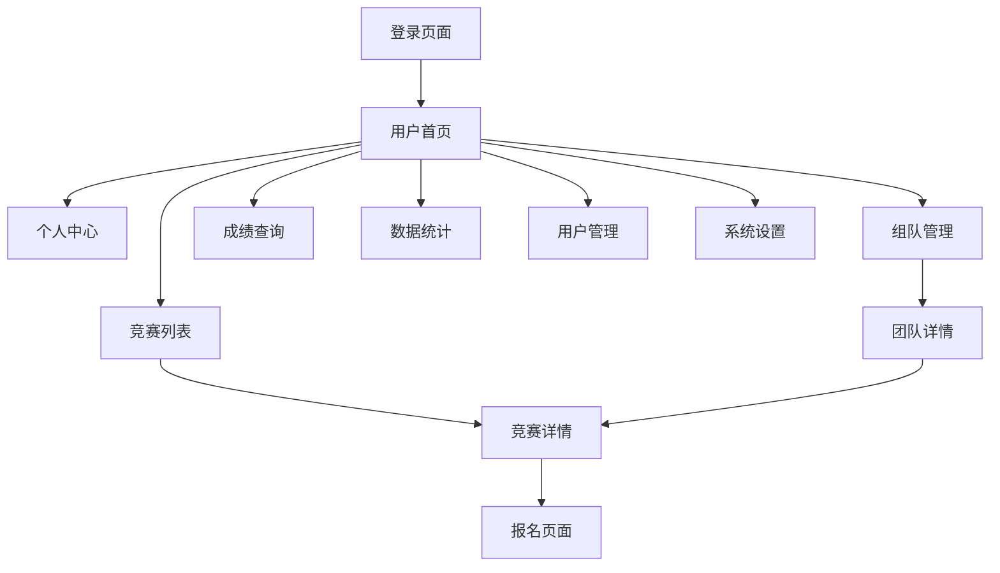

# 学科北城竞赛管理系统 - 产品需求文档

## 1. 产品概述

北城学科北城竞赛管理系统是一个数字化管理平台，旨在解决传统高校学科竞赛管理中信息分散、流程割裂、专业适配不足、数据统计滞后等问题。

系统为学生、教师、管理员等多角色用户提供一站式服务：学生可高效定位适配竞赛并便捷完成组队报名；教师能一站式开展竞赛发布与成绩管理；管理员借助数据统计优化竞赛布局。

该系统将显著提升高校学科竞赛管理效率，促进学生参赛积极性，为教育数字化转型提供有力支撑。

## 2. 核心功能

### 2.1 用户角色

| 角色 | 注册方式 | 核心权限 |
|------|----------|----------|
| 学生 | 邮箱注册 | 竞赛筛选、报名、组队、成绩查询 |
| 教师 | 工号注册，需管理员审核 | 竞赛发布、题库管理、成绩录入、报名审核 |
| 管理员 | 系统预设账号 | 全系统管理、用户权限、数据统计、系统配置 |

### 2.2 功能模块

系统主要包含以下核心页面：

1. **登录注册页面**：用户身份验证、角色区分登录
2. **首页**：竞赛展示、快速导航、系统通知
3. **竞赛管理页面**：竞赛列表、详情展示、筛选功能
4. **个人中心页面**：个人信息管理、密码修改
5. **组队管理页面**：团队创建、成员邀请、组队报名
6. **成绩管理页面**：成绩录入、查询、排名展示
7. **用户管理页面**：用户信息维护、权限管理
8. **数据统计页面**：参赛数据分析、获奖率统计
9. **系统设置页面**：参数配置、通知管理
10. **教师注册页面**：教师注册申请、审核状态查询
11. **教师工作台页面**：教师专用工作台、安全设置
12. **报名管理页面**：学生报名审核、审核记录管理
13. **题库管理页面**：题目增删改查、题目关联管理

### 2.3 页面详情

| 页面名称 | 模块名称 | 功能描述 |
|----------|----------|----------|
| 登录注册页面 | 用户认证模块 | 支持学生、教师、管理员三种角色登录；学生邮箱注册；教师工号注册需审核 |
| 登录注册页面 | 登出功能模块 | 提供"退出登录"按钮，清除用户会话，自动跳转至登录页面 |
| 首页 | 竞赛展示模块 | 展示热门竞赛、最新通知；提供快速导航入口 |
| 首页 | 导航模块 | 根据用户角色显示对应功能菜单 |
| 竞赛管理页面 | 竞赛列表模块 | 展示竞赛信息、支持专业筛选、状态筛选 |
| 竞赛管理页面 | 竞赛筛选模块 | 提供筛选条件（专业、状态、时间等），根据条件显示匹配的竞赛列表 |
| 竞赛管理页面 | 竞赛详情模块 | 点击竞赛名称进入详情页，展示完整的竞赛信息、报名入口、获奖名单 |
| 竞赛管理页面 | 单人报名模块 | 在竞赛详情页提供报名表单，提交后保存报名记录，显示"报名成功，待审核"状态 |
| 竞赛管理页面 | 团队报名模块 | 队长可选择"组队报名"，提交团队信息后确认报名，显示"报名成功，待审核"提示 |
| 竞赛管理页面 | 获奖名单模块 | 在竞赛详情页提供"获奖名单"入口，展示完整的获奖名单及对应奖项 |
| 竞赛管理页面 | 竞赛发布模块 | 教师发布新竞赛、编辑竞赛信息、状态管理 |
| 教师注册页面 | 教师注册模块 | 提供"教师注册"入口界面，包含工号、姓名（2-10字符）、学科、联系方式、初始密码等必填字段，提交后标记为"待审核"状态 |
| 教师工作台页面 | 工作台首页模块 | 审核通过的教师登录后显示工作台首页，展示欢迎信息、待处理事项、快速操作入口 |
| 教师工作台页面 | 安全设置模块 | 在"安全设置"中提供"修改密码"选项，验证原密码后允许设置新密码，成功后提示重新登录 |
| 报名管理页面 | 报名审核模块 | 教师在"报名管理"中查看待审核报名列表，可选择"通过"或"驳回"并填写审核理由，系统自动通知学生审核结果 |
| 题库管理页面 | 题目添加模块 | 教师填写完整题目信息（题目内容、答案、分值等），提交后提示"题目添加成功" |
| 题库管理页面 | 题目编辑模块 | 可修改未关联竞赛的题目信息，保存后提示"编辑成功"，已关联竞赛的题目不可编辑 |
| 题库管理页面 | 题目删除模块 | 仅可删除未关联竞赛的题目，删除前确认提示，删除后提示"删除成功" |
| 成绩管理页面 | 成绩录入模块 | 竞赛状态为"评审中"时教师可录入参赛者得分，支持单个录入和批量导入 |
| 成绩管理页面 | 成绩发布模块 | 教师确认成绩无误后点击发布，系统提示"成绩发布成功"并自动通知所有参赛学生，发布后成绩锁定不可修改 |
| 个人中心页面 | 个人信息管理模块 | 提供信息编辑界面，用户修改后点击"保存"按钮，系统更新数据库并显示"保存成功"提示 |
| 个人中心页面 | 密码修改模块 | 提供密码修改表单，验证原密码有效性，验证通过后更新密码并显示"修改成功"，验证失败显示"密码不正确"提示 |
| 个人中心页面 | 报名状态查询模块 | 在"我的报名"界面展示所有报名记录，系统实时更新报名状态 |
| 组队管理页面 | 团队创建模块 | 提供"创建团队"选项，创建成功后生成团队信息，创建者自动成为队长，显示"团队创建成功"提示 |
| 组队管理页面 | 队员邀请模块 | 在团队详情页提供邀请表单，输入学号后发送邀请通知，队员确认后加入团队 |
| 组队管理页面 | 团队协作模块 | 成员管理、团队报名、状态跟踪 |
| 成绩管理页面 | 成绩录入模块 | 教师录入参赛成绩、批量导入功能 |
| 成绩管理页面 | 成绩查询模块 | 竞赛结果发布后，在"成绩查询"界面显示个人得分和排名 |
| 成绩管理页面 | 成绩发布模块 | 成绩预览、正式发布、通知推送 |
| 用户管理页面 | 用户信息模块 | 管理员维护用户信息、权限分配 |
| 用户管理页面 | 审核管理模块 | 教师注册审核、信息变更审核 |
| 数据统计页面 | 参赛统计模块 | 生成参赛趋势报表、专业分布分析 |
| 数据统计页面 | 获奖分析模块 | 获奖率统计、奖项分布图表 |
| 系统设置页面 | 参数配置模块 | 系统参数设置、业务规则配置 |
| 系统设置页面 | 通知管理模块 | 全局通知发布、消息推送管理 |

## 3. 核心流程

### 学生用户流程
学生注册登录后，可在竞赛列表中根据专业筛选适合的竞赛，查看详情后选择单人报名或创建团队进行组队报名。报名成功后可在个人中心查看报名状态，竞赛结束后查询成绩和排名。

**详细功能流程：**
- **个人信息管理**：在个人中心编辑个人信息，点击保存后系统更新数据库并提示"保存成功"
- **密码修改**：在个人中心填写密码修改表单，验证原密码后更新新密码，显示相应成功或失败提示
- **用户登出**：点击"退出登录"按钮，系统清除用户会话并跳转至登录页面
- **竞赛筛选**：在竞赛列表页面使用筛选条件（专业、状态、时间等）查找匹配的竞赛
- **竞赛详情查看**：点击竞赛名称进入详情页，查看完整竞赛信息和获奖名单
- **单人报名**：在竞赛详情页填写报名表单，提交后显示"报名成功，待审核"状态
- **团队管理**：在组队管理界面创建团队，系统生成团队信息，创建者自动成为队长
- **队员邀请**：在团队详情页输入学号发送邀请，队员确认后加入团队
- **团队报名**：队长在竞赛详情页选择"组队报名"，提交团队信息后显示审核状态
- **报名状态查询**：在"我的报名"界面查看所有报名记录和实时状态更新
- **成绩查询**：竞赛结果发布后，在"成绩查询"界面查看个人得分和排名
- **获奖名单查看**：在竞赛详情页查看完整的获奖名单及对应奖项

### 教师用户流程
教师通过工号注册并等待管理员审核，审核通过后可发布竞赛、管理题库、审核学生报名。竞赛进行中可录入成绩，竞赛结束后发布最终成绩和排名。

**详细功能流程：**
- **教师注册**：在注册页面填写工号、姓名（2-10字符）、学科、联系方式、初始密码等必填字段，提交后系统标记为"待审核"状态，显示"注册申请已提交，请等待管理员审核"提示
- **教师登录**：审核通过后使用工号和密码登录，成功后跳转至工作台首页并显示欢迎信息，登录失败提示"账号或密码错误"
- **个人信息管理**：登录后通过"个人中心"编辑姓名、联系方式、简介、头像，保存后提示"个人信息更新成功，需管理员确认后生效"，管理员审核通过后更新内容
- **密码修改**：在"安全设置"中提供"修改密码"选项，需验证原密码并输入新密码，成功修改后提示"密码修改成功，请重新登录"，错误情况给出相应提示
- **退出登录**：点击"退出登录"按钮清除会话，跳转至登录界面并显示"已安全退出"
- **竞赛发布**：填写完整竞赛信息后提交审核，提示"竞赛发布申请已提交，待管理员审核"
- **竞赛编辑**：可修改已发布竞赛信息，保存后提示"修改成功"并通知已报名用户
- **竞赛状态管理**：可更新竞赛状态并通知用户，首页列表同步更新
- **报名审核**：在"报名管理"中处理待审核报名，可选择"通过"或"驳回"并填写理由，系统更新状态并通知学生
- **题库管理**：添加题目时填写完整题目信息后提示"题目添加成功"；编辑未关联竞赛的题目，提示"编辑成功"；删除未关联竞赛的题目，提示"删除成功"
- **成绩录入**：竞赛状态为"评审中"时可录入得分
- **成绩发布**：确认无误后发布成绩，提示"成绩发布成功"并通知学生，发布后成绩不可修改，需管理员授权

### 管理员用户流程
管理员登录后可管理全系统用户、审核教师注册、配置专业-竞赛适配规则、查看数据统计报表，并进行系统参数配置和通知管理。

## 4. 用户界面设计

### 4.1 设计风格

- **主色调**：蓝色系 (#409EFF) 体现专业性，辅助色为绿色 (#67C23A) 表示成功状态
- **按钮样式**：圆角按钮设计，主要按钮采用实心样式，次要按钮采用边框样式
- **字体**：系统默认字体，标题使用 16-20px，正文使用 14px，辅助信息使用 12px
- **布局风格**：卡片式布局，顶部导航栏 + 侧边菜单 + 主内容区域
- **图标风格**：使用 Element Plus 内置图标，简洁现代的线性图标

### 4.2 页面设计概览

| 页面名称 | 模块名称 | UI元素 |
|----------|----------|--------|
| 登录注册页面 | 登录表单 | 居中卡片布局，蓝色主题，表单验证提示，角色选择标签页 |
| 首页 | 导航栏 | 顶部固定导航，Logo + 用户信息 + 退出按钮，深蓝色背景 |
| 首页 | 侧边菜单 | 左侧折叠菜单，根据角色显示不同菜单项，图标 + 文字 |
| 首页 | 内容区域 | 竞赛卡片网格布局，每卡片包含标题、时间、状态标签 |
| 竞赛管理页面 | 筛选区域 | 顶部筛选条件，下拉选择 + 搜索框 + 筛选按钮 |
| 竞赛管理页面 | 竞赛列表 | 表格布局，支持排序和分页，状态用不同颜色标签区分 |
| 个人中心页面 | 信息表单 | 左右分栏布局，左侧头像上传，右侧表单信息 |
| 组队管理页面 | 团队卡片 | 卡片式展示团队信息，成员头像列表，操作按钮组 |
| 数据统计页面 | 图表区域 | 使用 ECharts 图表库，柱状图 + 饼图 + 折线图组合 |
| 教师注册页面 | 注册表单 | 居中卡片布局，包含工号、姓名、学科下拉选择、联系方式、密码输入框，表单验证提示，提交按钮 |
| 教师工作台页面 | 工作台布局 | 顶部欢迎横幅，中间待处理事项卡片网格，底部快速操作按钮组，整体采用仪表板风格 |
| 教师工作台页面 | 安全设置区域 | 左侧设置菜单，右侧密码修改表单，原密码和新密码输入框，确认按钮 |
| 报名管理页面 | 审核列表 | 表格布局显示待审核报名，包含学生信息、竞赛名称、报名时间，操作列提供"通过"和"驳回"按钮 |
| 报名管理页面 | 审核操作区 | 弹窗形式的审核理由输入框，确认和取消按钮，审核结果状态标签 |
| 题库管理页面 | 题目列表 | 表格布局展示题目信息，包含题目标题、类型、难度、关联状态，操作列提供编辑和删除按钮 |
| 题库管理页面 | 题目编辑器 | 富文本编辑器支持题目内容编辑，答案选项配置区域，分值设置，保存和取消按钮 |

### 4.3 响应式设计

系统采用桌面优先的响应式设计，主要面向 PC 端用户使用。在移动端进行适配优化，侧边菜单在小屏幕下自动折叠，表格在移动端转换为卡片式布局，确保在平板和手机上的良好使用体验。