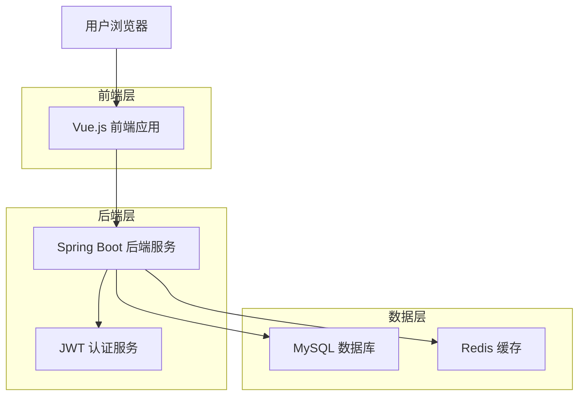
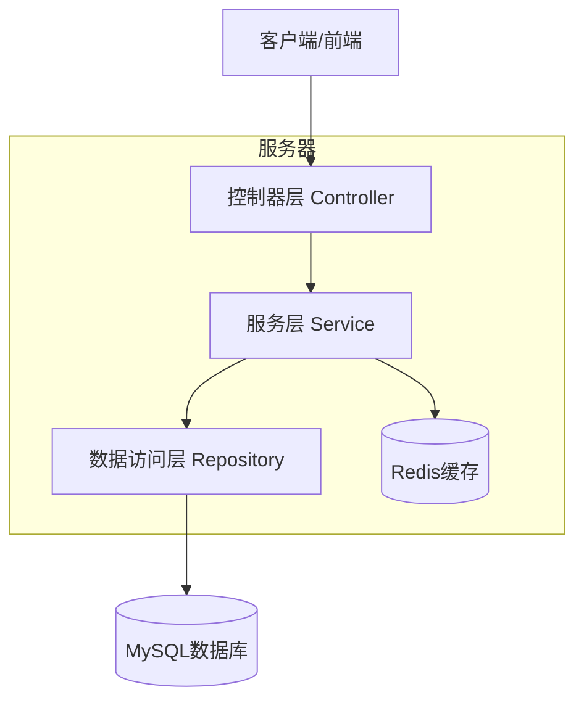
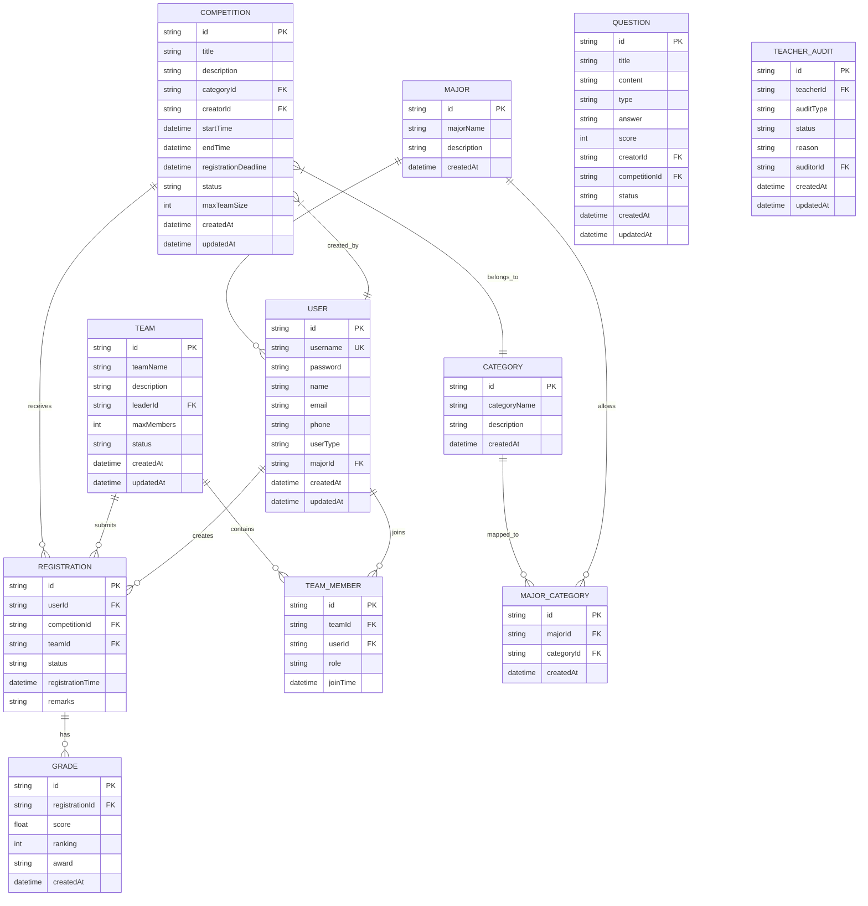

# 学科竞赛管理系统 - 技术架构文档

## 1. 架构设计



## 2. 技术描述

- **前端**: Vue.js@3 + Element Plus@2 + Axios + Vue Router@4 + Pinia + Vite
- **后端**: Spring Boot@2.7 + Spring Security + Spring Data JPA + MySQL + Redis
- **认证**: JWT (JSON Web Token)
- **构建工具**: Vite (前端) + Maven (后端)

## 3. 路由定义

| 路由 | 用途 |
|------|------|
| / | 首页，展示竞赛列表和系统概览 |
| /login | 登录页面，支持学生、教师、管理员登录 |
| /register | 注册页面，学生和教师注册 |
| /competitions | 竞赛管理页面，竞赛列表和筛选 |
| /competitions/:id | 竞赛详情页面，显示具体竞赛信息 |
| /profile | 个人中心，个人信息管理 |
| /teams | 组队管理页面，团队创建和管理 |
| /teams/:id | 团队详情页面，成员管理和报名 |
| /grades | 成绩管理页面，成绩查询和录入 |
| /registrations | 报名管理页面，查看报名状态 |
| /admin/users | 用户管理页面（管理员） |
| /admin/competitions | 竞赛审核页面（管理员） |
| /admin/statistics | 数据统计页面（管理员） |
| /admin/settings | 系统设置页面（管理员） |
| /teacher/register | 教师注册页面 |
| /teacher/dashboard | 教师工作台首页 |
| /teacher/profile | 教师个人中心 |
| /teacher/security | 教师安全设置页面 |
| /teacher/competitions | 教师竞赛管理页面 |
| /teacher/competitions/create | 竞赛发布页面 |
| /teacher/competitions/:id/edit | 竞赛编辑页面 |
| /teacher/registrations | 报名审核管理页面 |
| /teacher/questions | 题库管理页面（教师） |
| /teacher/questions/create | 题目添加页面 |
| /teacher/questions/:id/edit | 题目编辑页面 |
| /teacher/grades | 成绩录入页面（教师） |
| /teacher/grades/publish | 成绩发布页面 |

## 4. API定义

### 4.1 核心API

**用户认证相关**
```
POST /api/auth/login
```

请求参数:
| 参数名 | 参数类型 | 是否必需 | 描述 |
|--------|----------|----------|------|
| username | string | true | 用户名（学号/工号/管理员账号） |
| password | string | true | 密码 |
| userType | string | true | 用户类型（student/teacher/admin） |

响应参数:
| 参数名 | 参数类型 | 描述 |
|--------|----------|------|
| success | boolean | 登录是否成功 |
| token | string | JWT令牌 |
| userInfo | object | 用户基本信息 |

示例:
```json
{
  "username": "20210001",
  "password": "123456",
  "userType": "student"
}
```

**竞赛管理相关**
```
GET /api/competitions
```

请求参数:
| 参数名 | 参数类型 | 是否必需 | 描述 |
|--------|----------|----------|------|
| page | number | false | 页码，默认1 |
| size | number | false | 每页数量，默认10 |
| category | string | false | 竞赛分类筛选 |
| status | string | false | 竞赛状态筛选 |
| major | string | false | 专业筛选 |

响应参数:
| 参数名 | 参数类型 | 描述 |
|--------|----------|------|
| success | boolean | 请求是否成功 |
| data | array | 竞赛列表数据 |
| total | number | 总记录数 |

**组队管理相关**
```
POST /api/teams
```

请求参数:
| 参数名 | 参数类型 | 是否必需 | 描述 |
|--------|----------|----------|------|
| teamName | string | true | 团队名称 |
| description | string | false | 团队描述 |
| maxMembers | number | true | 最大成员数 |

响应参数:
| 参数名 | 参数类型 | 描述 |
|--------|----------|------|
| success | boolean | 创建是否成功 |
| teamId | string | 团队ID |
| message | string | 响应消息 |

**个人信息管理相关**
```
PUT /api/users/profile
```

请求参数:
| 参数名 | 参数类型 | 是否必需 | 描述 |
|--------|----------|----------|------|
| name | string | false | 姓名 |
| email | string | false | 邮箱 |
| phone | string | false | 电话 |

响应参数:
| 参数名 | 参数类型 | 描述 |
|--------|----------|------|
| success | boolean | 更新是否成功 |
| message | string | 响应消息 |

**密码修改相关**
```
PUT /api/users/password
```

请求参数:
| 参数名 | 参数类型 | 是否必需 | 描述 |
|--------|----------|----------|------|
| oldPassword | string | true | 原密码 |
| newPassword | string | true | 新密码 |

响应参数:
| 参数名 | 参数类型 | 描述 |
|--------|----------|------|
| success | boolean | 修改是否成功 |
| message | string | 响应消息 |

**报名管理相关**
```
POST /api/registrations
```

请求参数:
| 参数名 | 参数类型 | 是否必需 | 描述 |
|--------|----------|----------|------|
| competitionId | string | true | 竞赛ID |
| teamId | string | false | 团队ID（团队报名时必需） |
| registrationType | string | true | 报名类型（individual/team） |

响应参数:
| 参数名 | 参数类型 | 描述 |
|--------|----------|------|
| success | boolean | 报名是否成功 |
| registrationId | string | 报名记录ID |
| message | string | 响应消息 |

```
GET /api/registrations/my
```

请求参数:
| 参数名 | 参数类型 | 是否必需 | 描述 |
|--------|----------|----------|------|
| page | number | false | 页码，默认1 |
| size | number | false | 每页数量，默认10 |
| status | string | false | 状态筛选 |

响应参数:
| 参数名 | 参数类型 | 描述 |
|--------|----------|------|
| success | boolean | 请求是否成功 |
| data | array | 报名记录列表 |
| total | number | 总记录数 |

**成绩查询相关**
```
GET /api/grades/my
```

请求参数:
| 参数名 | 参数类型 | 是否必需 | 描述 |
|--------|----------|----------|------|
| competitionId | string | false | 竞赛ID筛选 |
| page | number | false | 页码，默认1 |
| size | number | false | 每页数量，默认10 |

响应参数:
| 参数名 | 参数类型 | 描述 |
|--------|----------|------|
| success | boolean | 请求是否成功 |
| data | array | 成绩记录列表 |
| total | number | 总记录数 |

**队员邀请相关**
```
POST /api/teams/{teamId}/invite
```

请求参数:
| 参数名 | 参数类型 | 是否必需 | 描述 |
|--------|----------|----------|------|
| studentId | string | true | 学生学号 |
| message | string | false | 邀请消息 |

响应参数:
| 参数名 | 参数类型 | 描述 |
|--------|----------|------|
| success | boolean | 邀请是否成功 |
| message | string | 响应消息 |

### 4.2 教师功能API

**教师注册相关**
```
POST /api/auth/teacher/register
```

请求参数:
| 参数名 | 参数类型 | 是否必需 | 描述 |
|--------|----------|----------|------|
| employeeId | string | true | 教师工号 |
| name | string | true | 姓名（2-10字符） |
| subject | string | true | 学科 |
| phone | string | true | 联系方式 |
| password | string | true | 初始密码 |

响应参数:
| 参数名 | 参数类型 | 描述 |
|--------|----------|------|
| success | boolean | 注册是否成功 |
| message | string | "注册申请已提交，请等待管理员审核" |

**竞赛发布相关**
```
POST /api/teacher/competitions
```

请求参数:
| 参数名 | 参数类型 | 是否必需 | 描述 |
|--------|----------|----------|------|
| title | string | true | 竞赛标题 |
| description | string | true | 竞赛描述 |
| categoryId | string | true | 竞赛分类ID |
| startTime | datetime | true | 开始时间 |
| endTime | datetime | true | 结束时间 |
| registrationDeadline | datetime | true | 报名截止时间 |
| maxTeamSize | number | true | 最大团队人数 |

响应参数:
| 参数名 | 参数类型 | 描述 |
|--------|----------|------|
| success | boolean | 发布是否成功 |
| message | string | "竞赛发布申请已提交，待管理员审核" |

**竞赛编辑相关**
```
PUT /api/teacher/competitions/{id}
```

请求参数:
| 参数名 | 参数类型 | 是否必需 | 描述 |
|--------|----------|----------|------|
| title | string | false | 竞赛标题 |
| description | string | false | 竞赛描述 |
| startTime | datetime | false | 开始时间 |
| endTime | datetime | false | 结束时间 |

响应参数:
| 参数名 | 参数类型 | 描述 |
|--------|----------|------|
| success | boolean | 编辑是否成功 |
| message | string | "修改成功" |

**报名审核相关**
```
GET /api/teacher/registrations/pending
```

响应参数:
| 参数名 | 参数类型 | 描述 |
|--------|----------|------|
| success | boolean | 请求是否成功 |
| data | array | 待审核报名列表 |

```
PUT /api/teacher/registrations/{id}/review
```

请求参数:
| 参数名 | 参数类型 | 是否必需 | 描述 |
|--------|----------|----------|------|
| action | string | true | 审核动作（approve/reject） |
| reason | string | false | 审核理由 |

响应参数:
| 参数名 | 参数类型 | 描述 |
|--------|----------|------|
| success | boolean | 审核是否成功 |
| message | string | 审核结果消息 |

**题库管理相关**
```
POST /api/teacher/questions
```

请求参数:
| 参数名 | 参数类型 | 是否必需 | 描述 |
|--------|----------|----------|------|
| title | string | true | 题目标题 |
| content | string | true | 题目内容 |
| type | string | true | 题目类型 |
| answer | string | true | 题目答案 |
| score | number | true | 题目分值 |

响应参数:
| 参数名 | 参数类型 | 描述 |
|--------|----------|------|
| success | boolean | 添加是否成功 |
| message | string | "题目添加成功" |

```
PUT /api/teacher/questions/{id}
```

请求参数:
| 参数名 | 参数类型 | 是否必需 | 描述 |
|--------|----------|----------|------|
| title | string | false | 题目标题 |
| content | string | false | 题目内容 |
| answer | string | false | 题目答案 |
| score | number | false | 题目分值 |

响应参数:
| 参数名 | 参数类型 | 描述 |
|--------|----------|------|
| success | boolean | 编辑是否成功 |
| message | string | "编辑成功" |

```
DELETE /api/teacher/questions/{id}
```

响应参数:
| 参数名 | 参数类型 | 描述 |
|--------|----------|------|
| success | boolean | 删除是否成功 |
| message | string | "删除成功" |

**成绩管理相关**
```
POST /api/teacher/grades
```

请求参数:
| 参数名 | 参数类型 | 是否必需 | 描述 |
|--------|----------|----------|------|
| registrationId | string | true | 报名记录ID |
| score | number | true | 得分 |
| ranking | number | false | 排名 |

响应参数:
| 参数名 | 参数类型 | 描述 |
|--------|----------|------|
| success | boolean | 录入是否成功 |
| message | string | 录入结果消息 |

```
POST /api/teacher/grades/publish
```

请求参数:
| 参数名 | 参数类型 | 是否必需 | 描述 |
|--------|----------|----------|------|
| competitionId | string | true | 竞赛ID |

响应参数:
| 参数名 | 参数类型 | 描述 |
|--------|----------|------|
| success | boolean | 发布是否成功 |
| message | string | "成绩发布成功" |

## 5. 服务器架构图



## 6. 数据模型

### 6.1 数据模型定义



### 6.2 数据定义语言

**用户表 (users)**
```sql
-- 创建用户表
CREATE TABLE users (
    id VARCHAR(36) PRIMARY KEY DEFAULT (UUID()),
    username VARCHAR(50) UNIQUE NOT NULL,
    password VARCHAR(255) NOT NULL,
    name VARCHAR(100) NOT NULL,
    email VARCHAR(255),
    phone VARCHAR(20),
    user_type ENUM('student', 'teacher', 'admin') NOT NULL,
    major_id VARCHAR(36),
    status ENUM('active', 'pending', 'disabled') DEFAULT 'active',
    created_at TIMESTAMP DEFAULT CURRENT_TIMESTAMP,
    updated_at TIMESTAMP DEFAULT CURRENT_TIMESTAMP ON UPDATE CURRENT_TIMESTAMP,
    INDEX idx_username (username),
    INDEX idx_user_type (user_type),
    INDEX idx_major_id (major_id)
);

-- 创建竞赛表
CREATE TABLE competitions (
    id VARCHAR(36) PRIMARY KEY DEFAULT (UUID()),
    title VARCHAR(200) NOT NULL,
    description TEXT,
    category_id VARCHAR(36) NOT NULL,
    creator_id VARCHAR(36) NOT NULL,
    start_time DATETIME NOT NULL,
    end_time DATETIME NOT NULL,
    registration_deadline DATETIME NOT NULL,
    status ENUM('draft', 'published', 'registration_open', 'registration_closed', 'ongoing', 'finished') DEFAULT 'draft',
    max_team_size INT DEFAULT 1,
    created_at TIMESTAMP DEFAULT CURRENT_TIMESTAMP,
    updated_at TIMESTAMP DEFAULT CURRENT_TIMESTAMP ON UPDATE CURRENT_TIMESTAMP,
    INDEX idx_category_id (category_id),
    INDEX idx_creator_id (creator_id),
    INDEX idx_status (status),
    INDEX idx_registration_deadline (registration_deadline)
);

-- 创建团队表
CREATE TABLE teams (
    id VARCHAR(36) PRIMARY KEY DEFAULT (UUID()),
    team_name VARCHAR(100) NOT NULL,
    description TEXT,
    leader_id VARCHAR(36) NOT NULL,
    max_members INT DEFAULT 5,
    status ENUM('active', 'disbanded') DEFAULT 'active',
    created_at TIMESTAMP DEFAULT CURRENT_TIMESTAMP,
    updated_at TIMESTAMP DEFAULT CURRENT_TIMESTAMP ON UPDATE CURRENT_TIMESTAMP,
    INDEX idx_leader_id (leader_id),
    INDEX idx_status (status)
);

-- 创建报名表
CREATE TABLE registrations (
    id VARCHAR(36) PRIMARY KEY DEFAULT (UUID()),
    user_id VARCHAR(36) NOT NULL,
    competition_id VARCHAR(36) NOT NULL,
    team_id VARCHAR(36),
    status ENUM('pending', 'approved', 'rejected') DEFAULT 'pending',
    registration_time TIMESTAMP DEFAULT CURRENT_TIMESTAMP,
    remarks TEXT,
    INDEX idx_user_id (user_id),
    INDEX idx_competition_id (competition_id),
    INDEX idx_team_id (team_id),
    INDEX idx_status (status),
    UNIQUE KEY uk_user_competition (user_id, competition_id)
);

-- 创建专业表
CREATE TABLE majors (
    id VARCHAR(36) PRIMARY KEY DEFAULT (UUID()),
    major_name VARCHAR(100) NOT NULL,
    description TEXT,
    created_at TIMESTAMP DEFAULT CURRENT_TIMESTAMP,
    INDEX idx_major_name (major_name)
);

-- 创建竞赛分类表
CREATE TABLE categories (
    id VARCHAR(36) PRIMARY KEY DEFAULT (UUID()),
    category_name VARCHAR(100) NOT NULL,
    description TEXT,
    created_at TIMESTAMP DEFAULT CURRENT_TIMESTAMP,
    INDEX idx_category_name (category_name)
);

-- 初始化数据
INSERT INTO majors (major_name, description) VALUES 
('计算机科学与技术', '计算机相关专业'),
('软件工程', '软件开发相关专业'),
('数学与应用数学', '数学相关专业'),
('物理学', '物理相关专业'),
('化学', '化学相关专业');

INSERT INTO categories (category_name, description) VALUES 
('程序设计竞赛', '编程算法类竞赛'),
('数学建模竞赛', '数学建模类竞赛'),
('物理竞赛', '物理学科竞赛'),
('化学竞赛', '化学学科竞赛'),
('创新创业竞赛', '创新创业类竞赛');

-- 创建题库表
CREATE TABLE questions (
    id VARCHAR(36) PRIMARY KEY DEFAULT (UUID()),
    title VARCHAR(200) NOT NULL,
    content TEXT NOT NULL,
    type ENUM('single_choice', 'multiple_choice', 'fill_blank', 'essay') NOT NULL,
    answer TEXT NOT NULL,
    score INT DEFAULT 0,
    creator_id VARCHAR(36) NOT NULL,
    competition_id VARCHAR(36),
    status ENUM('active', 'inactive') DEFAULT 'active',
    created_at TIMESTAMP DEFAULT CURRENT_TIMESTAMP,
    updated_at TIMESTAMP DEFAULT CURRENT_TIMESTAMP ON UPDATE CURRENT_TIMESTAMP,
    INDEX idx_creator_id (creator_id),
    INDEX idx_competition_id (competition_id),
    INDEX idx_type (type),
    INDEX idx_status (status)
);

-- 创建教师审核表
CREATE TABLE teacher_audits (
    id VARCHAR(36) PRIMARY KEY DEFAULT (UUID()),
    teacher_id VARCHAR(36) NOT NULL,
    audit_type ENUM('registration', 'profile_update', 'competition_publish') NOT NULL,
    status ENUM('pending', 'approved', 'rejected') DEFAULT 'pending',
    reason TEXT,
    auditor_id VARCHAR(36),
    created_at TIMESTAMP DEFAULT CURRENT_TIMESTAMP,
    updated_at TIMESTAMP DEFAULT CURRENT_TIMESTAMP ON UPDATE CURRENT_TIMESTAMP,
    INDEX idx_teacher_id (teacher_id),
    INDEX idx_audit_type (audit_type),
    INDEX idx_status (status),
    INDEX idx_auditor_id (auditor_id)
);

-- 修改用户表，添加教师审核状态字段
ALTER TABLE users ADD COLUMN audit_status ENUM('pending', 'approved', 'rejected') DEFAULT 'approved';
ALTER TABLE users ADD COLUMN employee_id VARCHAR(50) UNIQUE;
ALTER TABLE users ADD COLUMN subject VARCHAR(100);

INSERT INTO users (username, password, name, user_type) VALUES 
('admin', '$2a$10$N.zmdr9k7uOCQb376NoUnuTJ8iAt6Z5EHsM8lE9lBOsl7iKTVEFDi', '系统管理员', 'admin');

-- 初始化题目类型示例数据
INSERT INTO questions (title, content, type, answer, score, creator_id) VALUES 
('示例单选题', '以下哪个是正确的编程语言？\nA. Java\nB. Python\nC. C++\nD. 以上都是', 'single_choice', 'D', 10, (SELECT id FROM users WHERE username = 'admin')),
('示例多选题', '以下哪些是前端框架？\nA. Vue.js\nB. React\nC. Angular\nD. Spring Boot', 'multiple_choice', 'A,B,C', 15, (SELECT id FROM users WHERE username = 'admin'));

-- 为教师用户类型设置默认审核状态为待审核
UPDATE users SET audit_status = 'pending' WHERE user_type = 'teacher';
```