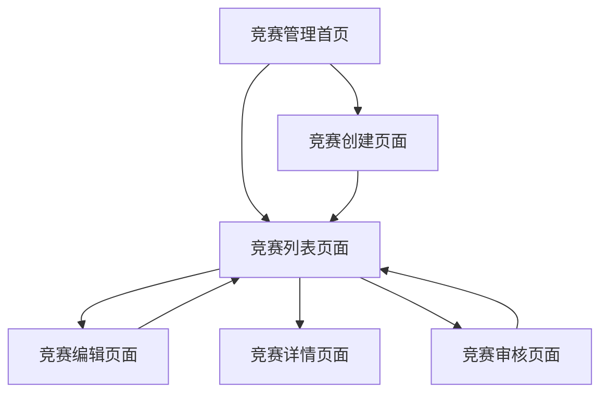

# 管理员竞赛管理模块产品需求文档

## 1. 产品概述

管理员竞赛管理模块是一个专为系统管理员设计的竞赛管理平台，提供全面的竞赛生命周期管理功能。该模块允许管理员创建、编辑、审核和监控竞赛活动，确保竞赛活动的规范化运行。

- 解决竞赛活动管理分散、审核流程不规范、数据统计困难等问题，为教育机构提供统一的竞赛管理解决方案。
- 目标是提升竞赛管理效率，规范竞赛流程，为学生和教师提供更好的竞赛参与体验。

## 2. 核心功能

### 2.1 用户角色

| 角色 | 注册方法 | 核心权限 |
|------|---------|----------|
| 系统管理员 | 系统预设账户 | 可管理所有竞赛、审核竞赛申请、查看统计数据、导出数据 |

### 2.2 功能模块

竞赛管理模块包含以下主要页面：

1. **竞赛列表页面**：竞赛数据展示、搜索筛选、批量操作功能
2. **竞赛创建页面**：竞赛信息录入、规则设置、时间配置
3. **竞赛编辑页面**：竞赛信息修改、状态更新、规则调整
4. **竞赛详情页面**：竞赛完整信息展示、参与统计、审核记录
5. **竞赛审核页面**：待审核竞赛列表、审核操作、审核意见记录

### 2.3 页面详情

| 页面名称 | 模块名称 | 功能描述 |
|----------|----------|----------|
| 竞赛列表页面 | 统计卡片 | 显示总竞赛数、待审核数、进行中数、已完成数等关键指标 |
| 竞赛列表页面 | 搜索筛选 | 按关键词、分类、级别、状态、时间范围筛选竞赛 |
| 竞赛列表页面 | 竞赛表格 | 展示竞赛基本信息、状态、创建者、时间等，支持排序和分页 |
| 竞赛列表页面 | 批量操作 | 批量审核、批量状态更新、批量删除功能 |
| 竞赛列表页面 | 导出功能 | 导出竞赛数据为Excel格式，支持筛选条件导出 |
| 竞赛创建页面 | 基本信息 | 录入竞赛名称、描述、分类、级别、主办方等基础信息 |
| 竞赛创建页面 | 时间设置 | 配置报名时间、竞赛时间，支持时间冲突检测 |
| 竞赛创建页面 | 参赛规则 | 设置团队规模、参赛人数限制、报名费用、奖项信息 |
| 竞赛创建页面 | 附加信息 | 上传竞赛海报、附件，设置联系方式、地点信息 |
| 竞赛编辑页面 | 信息修改 | 修改竞赛各项信息，保留修改历史记录 |
| 竞赛编辑页面 | 状态管理 | 更新竞赛状态（草稿、已发布、报名中、进行中、已结束等） |
| 竞赛详情页面 | 完整信息 | 展示竞赛所有详细信息，包括规则、时间、参与情况 |
| 竞赛详情页面 | 参与统计 | 显示报名人数、团队数量、浏览量等统计数据 |
| 竞赛详情页面 | 审核记录 | 查看竞赛审核历史、审核意见、操作日志 |
| 竞赛审核页面 | 待审核列表 | 显示所有待审核的竞赛申请，支持快速筛选 |
| 竞赛审核页面 | 审核操作 | 通过或拒绝竞赛申请，填写审核意见 |

## 3. 核心流程

### 管理员操作流程

1. **竞赛管理流程**：登录系统 → 进入竞赛管理页面 → 查看竞赛列表 → 执行管理操作（创建/编辑/审核/删除）
2. **竞赛创建流程**：点击创建竞赛 → 填写基本信息 → 设置时间规则 → 上传相关文件 → 提交保存
3. **竞赛审核流程**：进入审核页面 → 查看待审核竞赛 → 审查竞赛信息 → 填写审核意见 → 确认审核结果
4. **数据导出流程**：设置筛选条件 → 选择导出格式 → 生成导出文件 → 下载数据

## 4. 用户界面设计

### 4.1 设计风格

- **主色调**：蓝色系（#409EFF）作为主色，灰色系（#606266）作为辅助色
- **按钮风格**：圆角按钮设计，支持不同状态（主要、成功、警告、危险）
- **字体规范**：14px为主要字体大小，12px为辅助信息字体
- **布局风格**：卡片式布局，顶部导航，左侧固定操作区域
- **图标风格**：使用Element Plus图标库，简洁现代的线性图标

### 4.2 页面设计概览

| 页面名称 | 模块名称 | UI元素 |
|----------|----------|--------|
| 竞赛列表页面 | 页面标题 | 大标题"竞赛管理"，副标题说明，右侧操作按钮组 |
| 竞赛列表页面 | 统计卡片 | 4列网格布局，白色卡片，彩色图标，数字突出显示 |
| 竞赛列表页面 | 搜索区域 | 搜索框、下拉选择器、日期选择器，蓝色搜索按钮 |
| 竞赛列表页面 | 数据表格 | 斑马纹表格，固定表头，右侧操作列，分页组件 |
| 竞赛创建页面 | 表单区域 | 分步骤表单，左侧步骤导航，右侧内容区域 |
| 竞赛编辑页面 | 编辑表单 | 预填充数据的表单，突出显示修改字段 |
| 竞赛详情页面 | 信息展示 | 分区块展示，标签式信息组织，状态徽章 |
| 竞赛审核页面 | 审核界面 | 双栏布局，左侧竞赛信息，右侧审核操作 |

### 4.3 响应式设计

- **桌面优先设计**：主要针对管理员桌面端使用场景优化
- **移动端适配**：支持平板和手机访问，表格列自适应隐藏
- **触控优化**：按钮和操作区域适合触控操作，间距合理