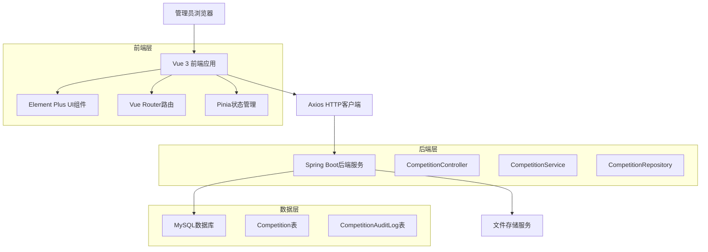
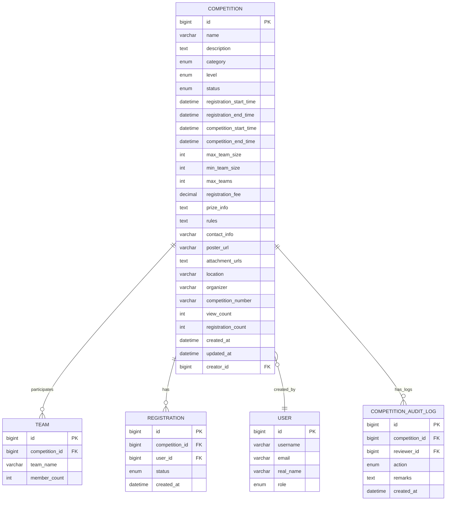

# 管理员竞赛管理模块技术架构文档

## 1. 架构设计



## 2. 技术描述

- **前端**：Vue 3 + Element Plus + TypeScript + Vite + TailwindCSS
- **后端**：Spring Boot + Spring Data JPA + MySQL
- **状态管理**：Pinia
- **HTTP客户端**：Axios
- **UI组件库**：Element Plus

## 3. 路由定义

| 路由 | 目的 |
|------|------|
| /admin/competitions | 竞赛管理主页，显示竞赛列表和统计信息 |
| /admin/competitions/create | 竞赛创建页面，用于新建竞赛 |
| /admin/competitions/:id/edit | 竞赛编辑页面，修改指定竞赛信息 |
| /admin/competitions/:id/detail | 竞赛详情页面，查看竞赛完整信息 |
| /admin/competitions/audit | 竞赛审核页面，处理待审核的竞赛申请 |

## 4. API定义

### 4.1 核心API

**竞赛列表查询**
```
GET /api/competitions
```

请求参数：
| 参数名称 | 参数类型 | 是否必需 | 描述 |
|----------|----------|----------|------|
| page | number | false | 页码，默认0 |
| size | number | false | 每页大小，默认10 |
| sortBy | string | false | 排序字段，默认createdAt |
| sortDir | string | false | 排序方向，默认desc |

响应：
| 参数名称 | 参数类型 | 描述 |
|----------|----------|------|
| success | boolean | 请求状态 |
| data | array | 竞赛列表数据 |
| totalElements | number | 总记录数 |
| totalPages | number | 总页数 |

**竞赛筛选查询**
```
GET /api/competitions/filter
```

请求参数：
| 参数名称 | 参数类型 | 是否必需 | 描述 |
|----------|----------|----------|------|
| keyword | string | false | 搜索关键词 |
| category | string | false | 竞赛分类 |
| status | string | false | 竞赛状态 |
| startDate | string | false | 开始日期 |
| endDate | string | false | 结束日期 |

**竞赛创建**
```
POST /api/competitions
```

请求体：
```json
{
  "name": "竞赛名称",
  "description": "竞赛描述",
  "category": "PROGRAMMING",
  "level": "SCHOOL",
  "registrationStartTime": "2024-01-01T00:00:00",
  "registrationEndTime": "2024-01-15T23:59:59",
  "competitionStartTime": "2024-02-01T09:00:00",
  "competitionEndTime": "2024-02-01T17:00:00",
  "maxTeamSize": 3,
  "minTeamSize": 1,
  "maxTeams": 100,
  "registrationFee": 0.0,
  "prizeInfo": "奖项信息",
  "rules": "竞赛规则",
  "contactInfo": "联系方式",
  "location": "比赛地点",
  "organizer": "主办方"
}
```

**竞赛审核**
```
POST /api/competitions/approve
```

请求体：
```json
{
  "competitionId": 1,
  "reviewerId": 1,
  "remarks": "审核意见"
}
```

**竞赛拒绝**
```
POST /api/competitions/reject
```

请求体：
```json
{
  "competitionId": 1,
  "reviewerId": 1,
  "remarks": "拒绝原因"
}
```

**竞赛统计信息**
```
GET /api/competitions/stats
```

响应：
```json
{
  "success": true,
  "data": {
    "totalCompetitions": 150,
    "pendingApproval": 12,
    "inProgress": 8,
    "completed": 95,
    "categoryStats": {
      "PROGRAMMING": 45,
      "MATHEMATICS": 30,
      "DESIGN": 25
    },
    "levelStats": {
      "SCHOOL": 80,
      "CITY": 40,
      "PROVINCE": 20
    }
  }
}
```

**批量状态更新**
```
PUT /api/competitions/batch-status
```

请求体：
```json
{
  "competitionIds": [1, 2, 3],
  "status": "PUBLISHED"
}
```

## 5. 数据模型

### 5.1 数据模型定义



### 5.2 数据定义语言

**竞赛表 (competitions)**
```sql
-- 创建竞赛表
CREATE TABLE competitions (
    id BIGINT PRIMARY KEY AUTO_INCREMENT,
    name VARCHAR(200) NOT NULL,
    description TEXT,
    category ENUM('PROGRAMMING', 'MATHEMATICS', 'PHYSICS', 'CHEMISTRY', 'BIOLOGY', 'ENGLISH', 'DESIGN', 'INNOVATION', 'OTHER') NOT NULL,
    level ENUM('SCHOOL', 'CITY', 'PROVINCE', 'NATIONAL', 'INTERNATIONAL') NOT NULL,
    status ENUM('DRAFT', 'PUBLISHED', 'REGISTRATION_OPEN', 'REGISTRATION_CLOSED', 'IN_PROGRESS', 'ONGOING', 'COMPLETED', 'CANCELLED', 'PENDING_APPROVAL') NOT NULL DEFAULT 'DRAFT',
    registration_start_time DATETIME NOT NULL,
    registration_end_time DATETIME NOT NULL,
    competition_start_time DATETIME NOT NULL,
    competition_end_time DATETIME NOT NULL,
    max_team_size INT DEFAULT 1,
    min_team_size INT DEFAULT 1,
    max_teams INT,
    registration_fee DECIMAL(10,2) DEFAULT 0.00,
    prize_info TEXT,
    rules TEXT,
    contact_info VARCHAR(255),
    poster_url VARCHAR(500),
    attachment_urls TEXT,
    location VARCHAR(255),
    organizer VARCHAR(255),
    competition_number VARCHAR(50) UNIQUE,
    view_count INT DEFAULT 0,
    registration_count INT DEFAULT 0,
    created_at TIMESTAMP DEFAULT CURRENT_TIMESTAMP,
    updated_at TIMESTAMP DEFAULT CURRENT_TIMESTAMP ON UPDATE CURRENT_TIMESTAMP,
    creator_id BIGINT NOT NULL,
    FOREIGN KEY (creator_id) REFERENCES users(id)
);

-- 创建索引
CREATE INDEX idx_competitions_category ON competitions(category);
CREATE INDEX idx_competitions_level ON competitions(level);
CREATE INDEX idx_competitions_status ON competitions(status);
CREATE INDEX idx_competitions_creator ON competitions(creator_id);
CREATE INDEX idx_competitions_registration_time ON competitions(registration_start_time, registration_end_time);
CREATE INDEX idx_competitions_competition_time ON competitions(competition_start_time, competition_end_time);

-- 竞赛审核日志表
CREATE TABLE competition_audit_logs (
    id BIGINT PRIMARY KEY AUTO_INCREMENT,
    competition_id BIGINT NOT NULL,
    reviewer_id BIGINT NOT NULL,
    action ENUM('APPROVE', 'REJECT', 'MODIFY') NOT NULL,
    remarks TEXT,
    created_at TIMESTAMP DEFAULT CURRENT_TIMESTAMP,
    FOREIGN KEY (competition_id) REFERENCES competitions(id) ON DELETE CASCADE,
    FOREIGN KEY (reviewer_id) REFERENCES users(id)
);

-- 创建审核日志索引
CREATE INDEX idx_audit_logs_competition ON competition_audit_logs(competition_id);
CREATE INDEX idx_audit_logs_reviewer ON competition_audit_logs(reviewer_id);
CREATE INDEX idx_audit_logs_created_at ON competition_audit_logs(created_at DESC);

-- 初始化数据
INSERT INTO competitions (name, description, category, level, status, registration_start_time, registration_end_time, competition_start_time, competition_end_time, creator_id, organizer, location)
VALUES 
('全国大学生程序设计竞赛', '面向全国大学生的程序设计竞赛', 'PROGRAMMING', 'NATIONAL', 'PUBLISHED', '2024-03-01 00:00:00', '2024-03-15 23:59:59', '2024-04-01 09:00:00', '2024-04-01 17:00:00', 1, '教育部', '北京大学'),
('数学建模竞赛', '培养学生数学建模能力的竞赛', 'MATHEMATICS', 'PROVINCE', 'REGISTRATION_OPEN', '2024-02-15 00:00:00', '2024-03-01 23:59:59', '2024-03-15 09:00:00', '2024-03-17 17:00:00', 1, '省教育厅', '清华大学');
```